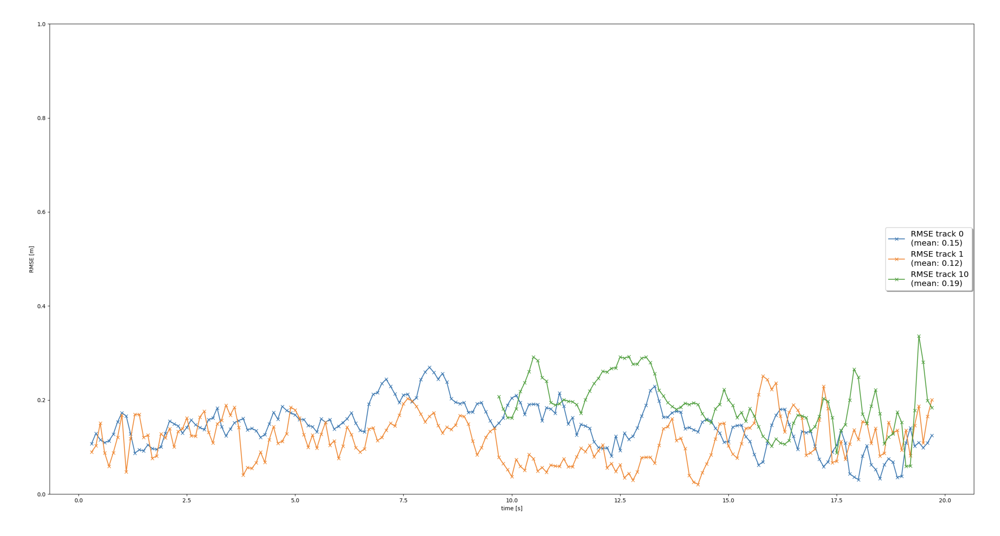
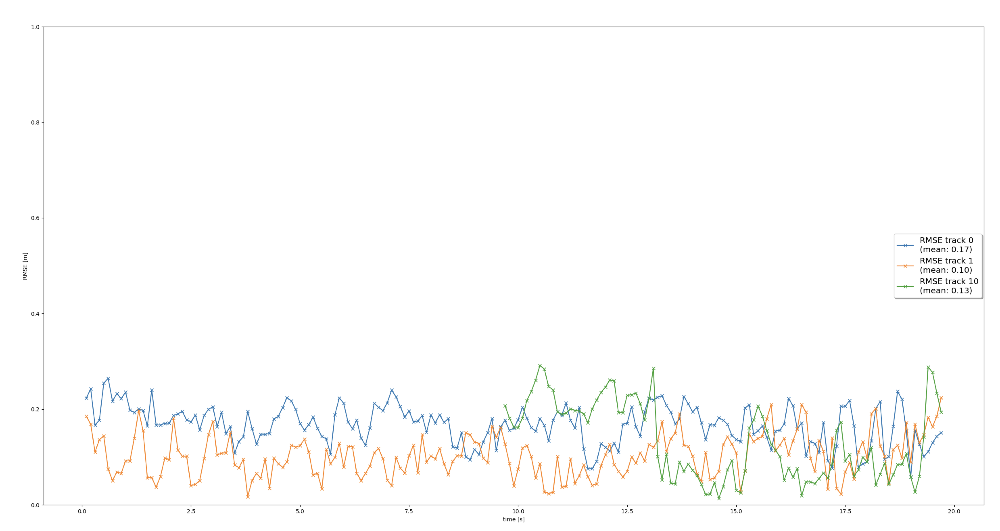

# Writeup: Track 3D-Objects Over Time

Please use this starter template to answer the following questions:

### 1. Write a short recap of the four tracking steps and what you implemented there (filter, track management, association, camera fusion). Which results did you achieve? Which part of the project was most difficult for you to complete, and why?

- implemented a EKF filter with it's predict() and and update() functions, with all neccessary matrices.
- implemented proper track initialization based on data coming from sensor. added mechanism to manange tracks and their states.
- implemented nearest-neighbour mechanism through association-matrix filled with MHD distances.
- implemented camera sensor functionality. Including checking whether the object is in a field of view, transforming vehicle to image coordinates

### 2. Do you see any benefits in camera-lidar fusion compared to lidar-only tracking (in theory and in your concrete results)?

There is a benefit of using camera in addition to lidar sensors. Lidar has lower quality detecting black objects consuming light and we can often get higher quality object detection from images

Aside from tracking, we can use computer-vision techniques which would be available only for image. Signs recognition, reading traffic lights

Below are the projects concrete results (RMSE) for lidar-only detection followed with camera-lidar fusion

### 3. Which challenges will a sensor fusion system face in real-life scenarios? Did you see any of these challenges in the project?

Sensors could be affected by environment conditions (rain, fog, etc.).

Optical occlusions might occur. Vehicles can be hidden from time to time.

Road vibrations could affect sensors accuracy, where calibration could become inaccurate.

### 4. Can you think of ways to improve your tracking results in the future?

- fine tune parameters and see how RMSE can be affected.

- use computer-vision - based camera detections and use it in tracking.

- use more advanced data association mechanism, such as Joint Probabilistic Data Association (JPDA)

- apply real-world physical model for vehicles, which could refine their predictions and reduce uncertainly
